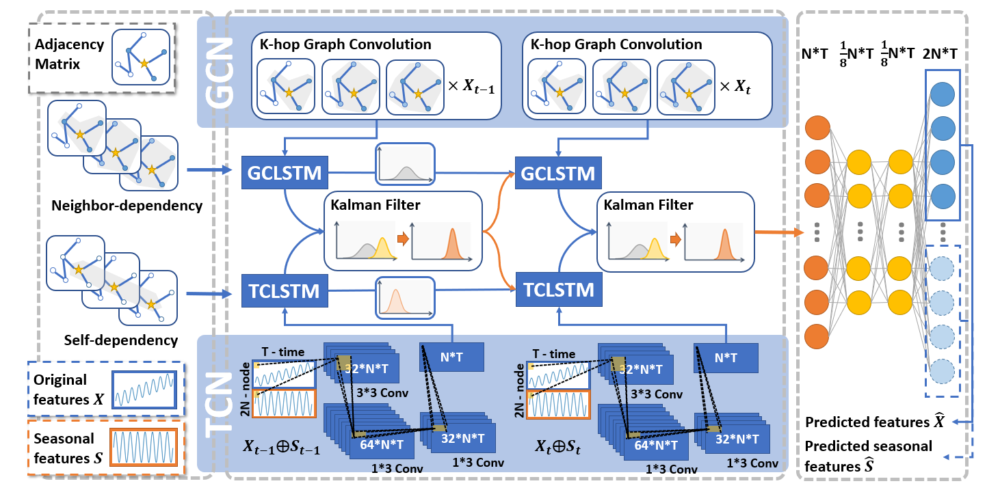

# S-DKFN



## Requirements
- torch==1.6.0
- numpy==1.20.3
- pandas==1.2.4
- scipy==1.6.2
- argparse
- time
- math

## Datasets

The S-DKFN model is tested on two real-world traffic speed datasets, METR-LA data and PEMS08 data with manually added anomalies. To run the code, you need to download the traffic speed data, adjacency matrices, and anomaly labels from the "_Dataset" folders.

## Model Training/Testing

This project contains two models, S-DKFN and DKFN. To train and test S-DKFN/DKFN with specific parameters, you can optionally change the main.py file. The commands for training/testing the models requires two parameters, `dataset` and `model`. Here are two examples:

```bash
# METR-LA
python main.py -dataset=metr_la10 -model=sdkfn

# PEMS08
python main.py -dataset=PEMS08 -model=dkfn
```

